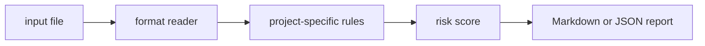

# notebook-clean-check

`notebook-clean-check` is a small local CLI that audit notebook files for outputs, hidden state, and risky local paths.

## Why it is useful

Research notebooks often reach reviews with outputs, local paths, and non-reproducible state. This CLI catches those issues before commit.

## Key features

- reads text, JSON, JSONL, or CSV inputs
- returns Markdown or JSON reports
- supports severity-based CI exit codes
- keeps all checks deterministic and offline
- includes focused rules for this project:
- `committed-output`: notebook output appears to be committed
- `execution-state`: execution count indicates hidden runtime state
- `local-path`: local machine path detected

## Installation

```bash
python -m pip install -e ".[dev]"
```

## Usage

```bash
notebook-clean-check examples/sample.txt
notebook-clean-check examples/sample.txt --json
notebook-clean-check path/to/input.txt --fail-on medium --out report.md
python -m notebook_clean_check --help
```

Example input:

```text
"outputs": [{"text": "secret result"}], execution_count: 42, /Users/alice/private.csv
```

## CLI options

```text
notebook-clean-check INPUT [--format auto|text|jsonl|csv|json] [--json]
             [--fail-on low|medium|high] [--out PATH]
```

`INPUT` is any notebook JSON or exported notebook text. The tool exits with code `2` when findings meet the selected
threshold, which makes it easy to use in GitHub Actions or release checks.

## Workflow



## Tests

```bash
ruff check .
pytest
python -m notebook_clean_check --help
```

## License

MIT
