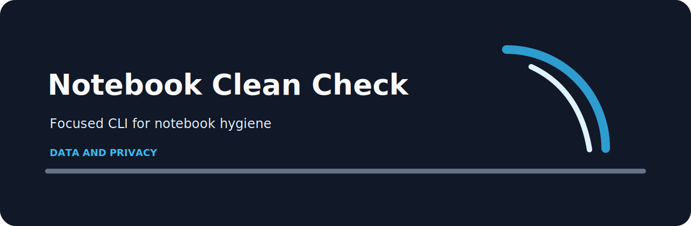

# Notebook Clean Check



Audit notebook files for outputs, hidden state, and risky local paths. This repo keeps the work close to the terminal: clear input, predictable output, and no service to babysit.

## Notebook Clean Check catches

- `committed-output` (high): notebook output appears to be committed. Fix: Clear outputs before review or store artifacts separately..
- `execution-state` (medium): execution count indicates hidden runtime state. Fix: Restart and run all cells before sharing..
- `local-path` (low): local machine path detected. Fix: Replace local paths with project-relative paths or parameters..

## A normal pass

```bash
git clone https://github.com/mertefekurt/notebook-clean-check.git
cd notebook-clean-check
python -m venv .venv
source .venv/bin/activate
python -m pip install -e ".[dev]"
notebook-clean-check examples/sample.txt
notebook-clean-check examples/sample.txt --json
```

The input can be text, JSON, JSONL, or CSV. Use `--json` when another script needs the result instead of a Markdown report.

## A deliberately bad line

```text

```

## Maintainer loop

```bash
ruff check .
pytest
python -m notebook_clean_check --help
```
