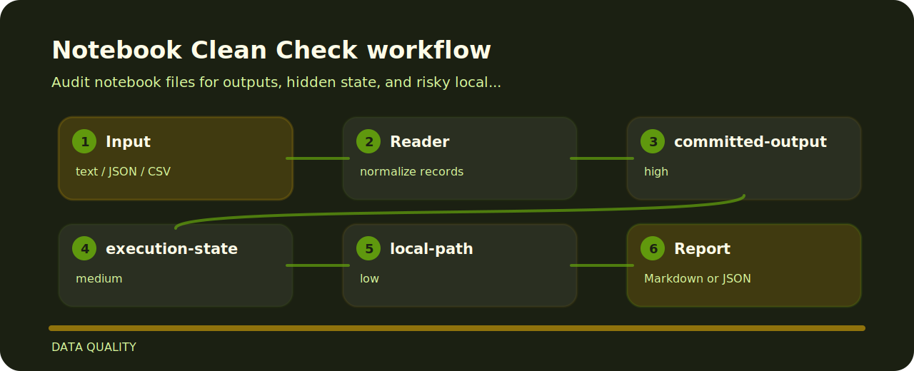

# Notebook Clean Check

Audit notebook files for outputs, hidden state, and risky local paths.


## Inspection line



## Where it helps

- Targets notebook hygiene instead of broad linting.
- Accepts plain text and returns terminal findings, optional json.
- Keeps each rule visible so the project can be tuned without hunting through prose.

## What gets flagged

- `committed-output` - notebook output appears to be committed (high); Clear outputs before review or store artifacts separately..
- `execution-state` - execution count indicates hidden runtime state (medium); Restart and run all cells before sharing..
- `local-path` - local machine path detected (low); Replace local paths with project-relative paths or parameters..

## Local check

```bash
git clone https://github.com/mertefekurt/notebook-clean-check.git
cd notebook-clean-check
python -m pip install -e ".[dev]"
notebook-clean-check examples/sample.txt
```
